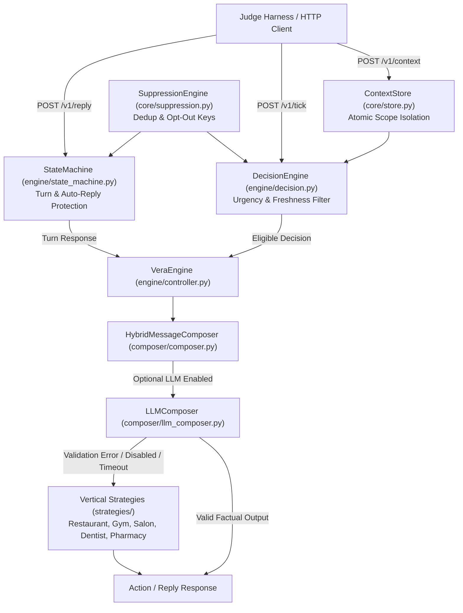

# Vera — Autonomous Merchant AI Assistant

[](https://www.python.org/)
[](https://fastapi.tiangolo.com/)
[](https://docs.pydantic.dev/)
[](https://docs.pytest.org/)

An autonomous, vertical-aware merchant AI assistant built for the **magicpin AI Challenge**. Vera drives proactive customer engagement and handles multi-turn interactions over WhatsApp for SMB retail and services categories in India: Restaurants, Gyms, Salons, Dentists, and Pharmacies.

---

## Table of Contents

- [1. Project Overview & Problem Statement](#1-project-overview--problem-statement)
- [2. Challenge Understanding & Requirement Traceability](#2-challenge-understanding--requirement-traceability)
- [3. Key Features](#3-key-features)
- [4. Architecture & System Flow](#4-architecture--system-flow)
- [5. Tech Stack & Project Structure](#5-tech-stack--project-structure)
- [6. How Vera Works](#6-how-vera-works)
- [7. Supported Merchant Categories](#7-supported-merchant-categories)
- [8. Installation & Local Setup](#8-installation--local-setup)
- [9. API Reference](#9-api-reference)
- [10. Configuration & Environment Variables](#10-configuration--environment-variables)
- [11. Dataset Architecture](#11-dataset-architecture)
- [12. Testing & Judge Simulator Evaluation](#12-testing--judge-simulator-evaluation)
- [13. Assumptions, Limitations & Future Work](#13-assumptions-limitations--future-work)
- [14. Submission & Team Information](#14-submission--team-information)

---

## 1. Project Overview & Problem Statement

magicpin operates a network of ~100,000 merchant partners across India. Engaging merchants over WhatsApp at scale requires balancing proactive outreach with strict domain accuracy, anti-spam protections, and WhatsApp Business constraints.

Existing automated messaging solutions suffer from four key operational pain points:
1. **Auto-Reply Pollution**: 40–70% of merchant responses are automated WhatsApp Business greeting bots ("Thank you for contacting..."). Generic bots burn multiple turns in loops.
2. **Intent-Handoff Failures**: When a merchant expresses commitment ("I want to join"), naive systems revert to qualification questions instead of advancing immediately to execution.
3. **Generic & Un-Grounded Copy**: Generic "10% off" discounts fail to engage Indian merchants. Service+price offerings (e.g., "Haircut @ ₹99", "Dental Cleaning @ ₹299") deliver significantly higher response rates.
4. **Regulatory & Taboo Risks**: Improper medical claims (e.g., "cures gum disease") violate vertical guidelines and trust.

### The Vera Solution
Vera addresses these challenges through a **deterministic rule-based state machine paired with a vertical domain composer and optional LLM synthesis layer**. Vera dynamically processes structured category, merchant, customer, and trigger contexts to deliver targeted proactive nudges and handle multi-turn conversational responses.

### Compact Tech Stack
- **Core Engine**: Python 3.11, FastAPI, Uvicorn, Pydantic v2
- **Testing & Benchmarks**: Pytest, FastAPI TestClient, Judge Simulator
- **Optional LLM Integrations**: Provider-agnostic adapters (`Gemini`, `OpenAI`, `Anthropic`, `DeepSeek`, `Groq`)

---

## 2. Challenge Understanding & Requirement Traceability

The project adheres to the official specifications in `challenge-brief.md` and `challenge-testing-brief.md`.

| Challenge Requirement | Source Section | Implemented Component | Verification Status |
| :--- | :--- | :--- | :--- |
| **4-Context Framework** | Brief §4<br>Testing Brief §3 | [`core/store.py`](file:///d:/magicpin-ai-challenge/core/store.py) (`ContextStore`) | **VERIFIED** — In-memory scope-isolated storage for `category`, `merchant`, `customer`, `trigger`. |
| **Atomic Optimistic Versioning** | Testing Brief §2.1 | [`core/store.py`](file:///d:/magicpin-ai-challenge/core/store.py) | **VERIFIED** — Replaces lower versions; rejects stale versions with HTTP `409 Conflict`. |
| **5 Domain Verticals** | Brief §4.1, §6 | [`strategies/`](file:///d:/magicpin-ai-challenge/strategies/) | **VERIFIED** — Rule strategies for Restaurants, Gyms, Salons, Dentists, Pharmacies. |
| **Proactive Wake-up (`/v1/tick`)** | Testing Brief §2.2 | [`engine/decision.py`](file:///d:/magicpin-ai-challenge/engine/decision.py) | **VERIFIED** — Evaluates active triggers, checks expiry, ranks urgency, returns `Action` items. |
| **Turn Reply (`/v1/reply`)** | Testing Brief §2.3 | [`engine/state_machine.py`](file:///d:/magicpin-ai-challenge/engine/state_machine.py) | **VERIFIED** — Processes turns, handles role transitions, returns `send`, `wait`, or `end`. |
| **Auto-Reply Loop Protection** | Brief §3, §12<br>Testing Brief §4 | [`engine/state_machine.py`](file:///d:/magicpin-ai-challenge/engine/state_machine.py) | **VERIFIED** — Detects canned bot text; suppresses outbound turns after $\ge 2$ consecutive hits. |
| **Intent Transition** | Brief §3, §12<br>Testing Brief §4 | [`engine/state_machine.py`](file:///d:/magicpin-ai-challenge/engine/state_machine.py) | **VERIFIED** — Detects affirmative response ("yes", "let's do it"); switches to action mode. |
| **Opt-Out & Deduplication** | Brief §3.2, §10 | [`core/suppression.py`](file:///d:/magicpin-ai-challenge/core/suppression.py) | **VERIFIED** — Synthesized key `{merchant_id}:{trigger_id}` deduplication & `STOP` opt-outs. |
| **Teardown Protocol** | Testing Brief §11 | [`main.py`](file:///d:/magicpin-ai-challenge/main.py#L41-L49) (`/v1/teardown`) | **VERIFIED** — Resets context store, suppression tables, and state machine counters. |
| **Deterministic Fallback** | Brief §7.1, §13 | [`composer/composer.py`](file:///d:/magicpin-ai-challenge/composer/composer.py) | **VERIFIED** — Instant fallback to deterministic strategy if LLM is disabled or invalid. |

---

## 3. Key Features

- **Scope-Isolated Context Storage**: Thread-safe context store enforcing scope rules (`category`, `merchant`, `customer`, `trigger`) and atomic version validation.
- **Urgency-Ranked Decision Engine**: Ranks active triggers based on urgency scores, freshness (`expires_at`), scope weight, and opt-out consent.
- **Canned Auto-Reply Detection**: Tracks repeated automated WhatsApp Business bot responses per merchant and gracefully exits to avoid loop pollution.
- **Intent-Aware State Machine**: Detects merchant commitment signals and seamlessly transitions from qualification to execution mode.
- **Domain-Specific Vertical Safeguards**: Programmatic checks enforcing medical taboo word filtering for dentists, pharmacy batch recall alerts, gym seasonal reframing, and salon timing nudges.
- **WhatsApp Compliance Sanitization**: Strips bare URLs, validates allowed CTAs (`open_ended`, `binary_yes_no`, `binary_confirm_cancel`, `multi_choice_slot`, `none`), and enforces valid `send_as` attributions.
- **Provider-Agnostic LLM Composer with Safe Fallback**: Supports optional LLM composition via OpenAI, Anthropic, Gemini, DeepSeek, or Groq, backed by strict factual price grounding and length checks.

---

## 4. Architecture & System Flow



### Component Roles
- **FastAPI Layer (`main.py`)**: Exposes the 6 HTTP endpoints with Pydantic request/response validation.
- **Context Store (`core/store.py`)**: Manages context records in memory; enforces version replacement and scope checking.
- **Suppression Engine (`core/suppression.py`)**: Manages synthesized trigger suppression keys and customer/merchant opt-out registries.
- **Decision Engine (`engine/decision.py`)**: Evaluates tick requests against active triggers, filters expired items, and ranks candidates by urgency.
- **State Machine (`engine/state_machine.py`)**: Tracks multi-turn state (`INITIAL`, `ENGAGED`, `OPTED_OUT`, `HANDOFF`), auto-reply counts, and intent transitions.
- **Vertical Strategies (`strategies/`)**: Implements vertical rules, taboo filters, and offer catalogs for 5 domains.
- **Hybrid Composer (`composer/`)**: Orchestrates optional LLM calls with price grounding, length verification, and deterministic rule fallbacks.

---

## 5. Tech Stack & Project Structure

### Repository Structure

```
magicpin-ai-challenge/
├── main.py                     # FastAPI server exposing HTTP API endpoints
├── config.py                   # Environment settings, metadata, dataset paths
├── judge_simulator.py          # Local judge simulator & evaluation benchmark
├── requirements.txt            # Project dependencies
├── README.md                   # Project documentation
├── core/                       # Core state and data structures
│   ├── models.py               # Pydantic data schemas for API and domain models
│   ├── store.py                # Scope-isolated ContextStore with versioning
│   └── suppression.py          # Deduplication and opt-out SuppressionEngine
├── engine/                     # Orchestration and state management
│   ├── controller.py           # VeraEngine coordinator
│   ├── decision.py             # Urgency-ranked DecisionEngine
│   └── state_machine.py        # Conversation turn state machine & auto-reply protection
├── strategies/                 # Domain-specific vertical strategies
│   ├── base.py                 # Abstract BaseStrategy class
│   ├── dentists.py             # Dentist domain strategy & taboo filters
│   ├── gyms.py                 # Gym domain strategy & seasonal reframing
│   ├── salons.py               # Salon domain strategy & bridal timing
│   ├── restaurants.py          # Restaurant domain strategy & IPL match triggers
│   └── pharmacies.py           # Pharmacy domain strategy & recall alerts
├── composer/                   # Message composition layer
│   ├── composer.py             # MessageComposer & strategy router
│   └── llm_composer.py         # Provider-agnostic LLM composer & validator
├── dataset_expanded/           # Expanded evaluation dataset (categories, merchants, customers, triggers)
│   ├── categories/             # 5 domain category contexts
│   ├── merchants/              # 50 merchant contexts
│   ├── customers/              # 200 customer contexts
│   └── triggers/               # 100 trigger contexts
├── tests/                      # Automated test suite (65 tests)
│   ├── test_api.py             # API endpoint integration tests
│   ├── test_composer.py        # Composer & LLM validator unit tests
│   ├── test_decision.py        # Decision engine unit tests
│   ├── test_simulator_scenarios.py # Judge simulator scenario tests
│   ├── test_state_machine.py   # State machine & auto-reply tests
│   ├── test_store.py           # Context store tests
│   ├── test_store_unittest.py  # Context store unittest suite
│   ├── test_suppression.py     # Suppression engine tests
│   └── test_vertical_strategies.py # Vertical strategy domain tests
└── examples/                   # Documentation examples
    ├── api-call-examples.md    # API payload walkthroughs
    └── case-studies.md         # Domain evaluation case studies
```

---

## 6. How Vera Works

### 1. Context Push (`POST /v1/context`)
1. Context update arrives with `scope`, `context_id`, `version`, and `payload`.
2. `ContextStore` checks existing stored version. If `version <= current_version`, rejects with HTTP `409 Conflict`.
3. If scope is invalid, rejects with HTTP `400 Bad Request`.
4. Saves record and returns HTTP `200 OK` (`ContextPushAck`).

### 2. Proactive Tick (`POST /v1/tick`)
1. Receives current simulated timestamp `now` and list of `available_triggers`.
2. `DecisionEngine` filters out expired triggers (`expires_at < now`), suppressed keys, and opted-out merchants/customers.
3. Ranks remaining eligible candidates by urgency score, scope weight, and source weight.
4. Generates an `Action` item with grounded body text, CTA, and suppression key.

### 3. Turn Reply (`POST /v1/reply`)
1. Evaluates incoming role (`merchant` or `customer`) and message content.
2. Checks for opt-out intent (`STOP`, `UNSUBSCRIBE`) $\rightarrow$ transitions state to `OPTED_OUT`.
3. Checks for canned bot auto-reply text $\rightarrow$ increments merchant auto-reply counter; if $\ge 2$ consecutive canned replies occur, returns `action: "end"` or `action: "wait"`.
4. Checks for affirmative commitment $\rightarrow$ transitions state to `HANDOFF` and returns action-mode execution copy.

---

## 7. Supported Merchant Categories

| Category | Slug | Key Domain Rules & Specificity Levers | Taboo Filters & Constraints |
| :--- | :--- | :--- | :--- |
| **Dentists** | `dentists` | Clinical peer tone, JIDA research citations, service+price catalog (`Dental Cleaning @ ₹299`), recall windows. | Prohibits `"cure"`, `"guaranteed"`, `"100% safe"`, `"miracle"`. |
| **Salons** | `salons` | Bridal season timing, haircut+styling combos (`Haircut @ ₹99`), weekend slot availability. | Avoids generic percentage discounts; favors clear service+price offers. |
| **Gyms** | `gyms` | Seasonal membership dip reframing, peer benchmark ratings, trial pass follow-ups. | Avoids ungrounded fitness claims; focuses on peer benchmarks. |
| **Restaurants** | `restaurants` | IPL match day promotions, high-margin thali combos, corporate lunch timing. | Restricts broad discount claims; anchors on event timing. |
| **Pharmacies** | `pharmacies` | Drug recall alerts (e.g. batch recall notices), chronic refill reminders, compliance. | Prohibits unverified medical advice or cure claims. |

---

## 8. Installation & Local Setup

### Environment Prerequisites
- **Python 3.10+** (Python 3.11 recommended)
- **Git**

### Step-by-Step Setup (Windows PowerShell)

1. **Clone Repository & Navigate**:
   ```powershell
   git clone https://github.com/tanisha242/vera-ai-challenge.git
   cd vera-ai-challenge
   ```

2. **Create & Activate Virtual Environment**:
   ```powershell
   python -m venv .venv
   .\.venv\Scripts\Activate.ps1
   ```

3. **Install Dependencies**:
   ```powershell
   pip install -r requirements.txt
   ```

4. **Start API Server**:
   ```powershell
   python main.py
   ```
   *The server starts locally at `http://localhost:8080`.*

### Cross-Platform / Linux Setup
```bash
python3 -m venv .venv
source .venv/bin/activate
pip install -r requirements.txt
python main.py
```

### Server URLs
- **Base API URL**: `http://localhost:8080`
- **Health Check**: `http://localhost:8080/v1/healthz`
- **OpenAPI Swagger UI**: `http://localhost:8080/docs`

---

## 9. API Reference

### 1. `GET /v1/healthz`
Liveness probe returning process uptime and loaded context counts per scope.

*(Illustrative Example Response)*:
```json
{
  "status": "ok",
  "uptime_seconds": 124,
  "contexts_loaded": {
    "category": 5,
    "merchant": 10,
    "customer": 25,
    "trigger": 0
  }
}
```

---

### 2. `GET /v1/metadata`
Returns bot identification, team details, approach summary, and version.

*(Illustrative Example Response)*:
```json
{
  "team_name": "Tanisha Joshi",
  "team_members": ["Tanisha Joshi"],
  "model": "gemini-1.5-flash",
  "approach": "Deterministic Rule-Based State Machine + Vertical-Aware Grounded Composer",
  "contact_email": "tanishajoshi2462@gmail.com",
  "version": "1.0.0",
  "submitted_at": "2026-04-26T08:00:00Z"
}
```

---

### 3. `POST /v1/context`
Pushes structured context into memory.

*(Illustrative Request Body)*:
```json
{
  "scope": "merchant",
  "context_id": "m_001_drmeera_dentist_delhi",
  "version": 1,
  "payload": {
    "merchant_id": "m_001_drmeera_dentist_delhi",
    "category_slug": "dentists",
    "identity": { "name": "Dr. Meera's Dental Clinic", "city": "Delhi" }
  },
  "delivered_at": "2026-09-27T00:00:00Z"
}
```

*(Illustrative Success Response - 200 OK)*:
```json
{
  "accepted": true,
  "ack_id": "ack_m_001_drmeera_dentist_delhi_v1",
  "stored_at": "2026-09-27T00:00:00.000000Z"
}
```

*(Stale Version Response - 409 Conflict)*:
```json
{
  "accepted": false,
  "reason": "stale_version",
  "current_version": 1
}
```

---

### 4. `POST /v1/tick`
Periodic wake-up request returning proactive actions.

*(Illustrative Request Body)*:
```json
{
  "now": "2026-09-27T10:00:00Z",
  "available_triggers": ["trg_003_recall_due_priya"]
}
```

*(Illustrative Response - 200 OK)*:
```json
{
  "actions": [
    {
      "conversation_id": "conv_m_001_trg_003",
      "merchant_id": "m_001_drmeera_dentist_delhi",
      "customer_id": "c_001_priya_for_m001",
      "send_as": "vera",
      "trigger_id": "trg_003_recall_due_priya",
      "template_name": "salon_nudge",
      "template_params": ["Meera"],
      "body": "Hi Priya, Dr. Meera's clinic here. Your 6-month cleaning recall is due. Available slots: Wed 5 Nov, 6pm or Thu 6 Nov, 5pm. Dental Cleaning @ ₹299.",
      "cta": "binary_yes_no",
      "suppression_key": "recall:c_001_priya_for_m001:6mo",
      "rationale": "High-urgency 6-month cleaning recall due for patient."
    }
  ]
}
```

---

### 5. `POST /v1/reply`
Processes incoming turn replies.

*(Illustrative Request Body)*:
```json
{
  "conversation_id": "conv_101",
  "merchant_id": "m_001_drmeera_dentist_delhi",
  "customer_id": null,
  "from_role": "merchant",
  "message": "Yes, let's set that up!",
  "received_at": "2026-09-27T10:05:00Z",
  "turn_number": 2
}
```

*(Illustrative Response - 200 OK)*:
```json
{
  "action": "send",
  "body": "Sending the details now. Draft prepared for review — reply CONFIRM to publish.",
  "cta": "open_ended",
  "wait_seconds": null,
  "rationale": "Affirmative merchant response; transitioning to action mode."
}
```

---

### 6. `POST /v1/teardown`
Clears all stored contexts, suppression keys, state machine history, and merchant auto-reply counters.

*(Illustrative Response - 200 OK)*:
```json
{
  "status": "ok",
  "cleared": true
}
```

---

## 10. Configuration & Environment Variables

Key configuration variables defined in [`config.py`](file:///d:/magicpin-ai-challenge/config.py):

| Variable | Default Value | Description |
| :--- | :--- | :--- |
| `HOST` | `0.0.0.0` | Server host binding |
| `PORT` | `8080` | Server port binding |
| `TEAM_NAME` | `"Tanisha Joshi"` | Team name in `/v1/metadata` |
| `MODEL_NAME` | `"gemini-1.5-flash"` | Model identifier in `/v1/metadata` |
| `CONTACT_EMAIL` | `"tanishajoshi2462@gmail.com"` | Contact email in `/v1/metadata` |
| `DATASET_DIR` | `./dataset_expanded` | Dataset directory location |
| `VERA_LLM_ENABLED` | `false` | Enable/disable optional LLM composition (`true`/`false`) |
| `VERA_LLM_PROVIDER` | `openai` | LLM provider: `openai`, `anthropic`, `gemini`, `deepseek`, `groq` |
| `VERA_LLM_API_KEY` | `""` | Optional API key for LLM provider |
| `VERA_LLM_MODEL` | `""` | Specific LLM model identifier |

### Offline Deterministic Mode & Fallback Guarantee
Vera runs in **deterministic offline mode (`VERA_LLM_ENABLED=false`) by default**. If LLM composition is enabled (`VERA_LLM_ENABLED=true`), generated responses undergo strict validation (`LLMMessageValidator`). If an LLM call fails, times out (>10s), or generates invalid copy (length >1000, taboo word violation, ungrounded price claim), Vera **instantly falls back to rule-based vertical strategies**.

---

## 11. Dataset Architecture

The repository includes structured evaluation datasets in `dataset_expanded/` and seed data in `dataset/`:

- **`dataset_expanded/categories/`**: 5 domain knowledge files (`dentists.json`, `salons.json`, `restaurants.json`, `gyms.json`, `pharmacies.json`).
- **`dataset_expanded/merchants/`**: 50 merchant profiles (10 per vertical) containing performance snapshots, active offers, signals, and review themes.
- **`dataset_expanded/customers/`**: 200 customer profiles containing relationship histories, service records, and consent scopes.
- **`dataset_expanded/triggers/`**: 100 sample triggers covering external events (digests, heatwaves, festivals) and internal account events (performance dips, recalls, renewals).

---

## 12. Testing & Judge Simulator Evaluation

### Automated Pytest Suite
Run the 65 automated unit and integration tests:
```powershell
pytest -v
```
*(All 65 tests pass in-process using FastAPI TestClient.)*

### Local Judge Simulator Benchmark
1. Start the server in terminal 1:
   ```powershell
   python main.py
   ```

2. Run the Judge Simulator in terminal 2:
   ```powershell
   $env:PYTHONIOENCODING="utf-8"
   python -u judge_simulator.py
   ```

3. Run a specific scenario (e.g., `phase2_short`):
   ```powershell
   $env:PYTHONIOENCODING="utf-8"
   $env:TEST_SCENARIO="phase2_short"
   python -u judge_simulator.py
   ```

*(Note: The simulator defaults to offline heuristic evaluation mode. Offline scores evaluate heuristic message quality and rule compliance.)*

---

## 13. Assumptions, Limitations & Future Work

### Current Implementation Limitations
1. **In-Memory Storage**: Context records are stored in-memory for high throughput. Restarting the server clears state unless repopulated via `/v1/context`.
2. **Auto-Reply Counter Scope**: Auto-reply bot detection tracks up to $\ge 2$ consecutive canned responses per merchant key before suppressing outbounds.

### Potential Future Enhancements
- Persistent database backing (e.g., Redis / PostgreSQL) for context survival across process restarts.
- Fine-tuned domain embedding retrieval (RAG) for expanded category research digests.

---

## 14. Submission Information

- **Participant**: Tanisha Joshi
- **Contact Email**: [tanishajoshi2462@gmail.com](mailto:tanishajoshi2462@gmail.com)
- **Repository**: [https://github.com/tanisha242/vera-ai-challenge](https://github.com/tanisha242/vera-ai-challenge)
